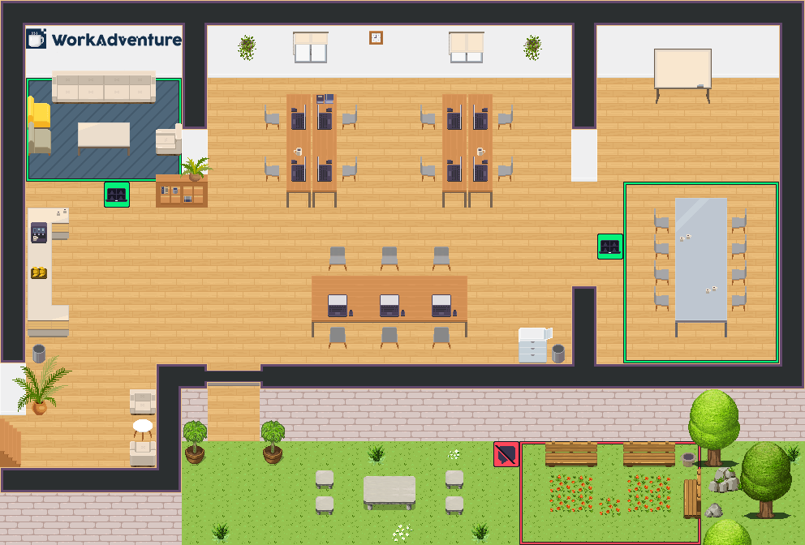
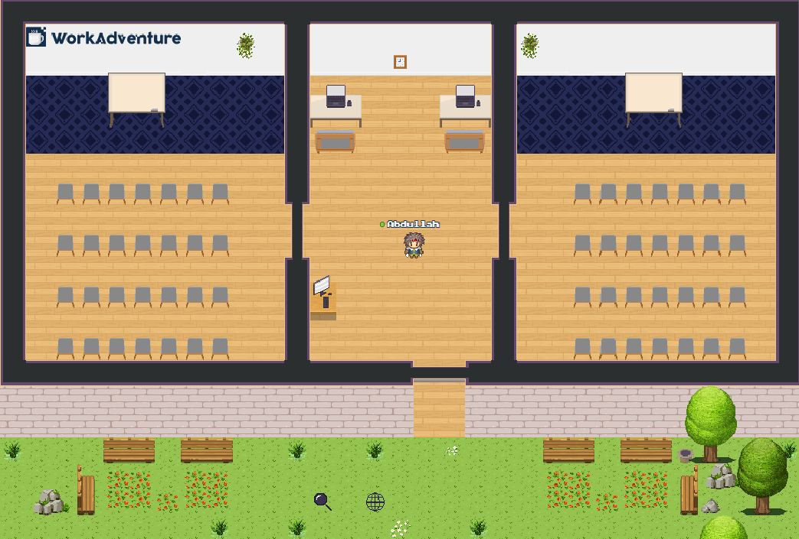

## Description

In this GitHub you can find the records and materials of our work on ARS from the e-learning module.
We want to create a rough overview of the topic of Audio Response Systems and lay the foundation for the coming semesters.
It is also possible to access our WorkAdventure room, which we used for our final presentation

## Sources

The following resources were used in the creation of this project:

| Resource | Description |
| --- | --- |
| https://workadventu.re/map-building-extra/tutorial.md | WorkAdventure Tutorial|
| https://ceur-ws.org/Vol-2092/paper12.pdf | Carsten Ullrich, Martin Wessner (Eds.): Proceedings of DeLFI and GMW Workshops 2017 Chemnitz, Germany, September 5, 20 |
| https://www.researchgate.net/profile/Karsten-Morisse/publication/257305620_Audience-Response-Systeme_fur_Peer-Assessments_in_Referateseminaren/links/0c960524d6f98baabc000000/Audience-Response-Systeme-fuer-Peer-Assessments-in-Referateseminaren.pdf | Ollermann, Frank, and Karsten Morisse. "Audience-Response-Systeme für Peer-Assessments in Referateseminaren." |
| https://www.youtube.com/watch?v=K16JN619PVA | ARSnova-Demo |
| https://www.youtube.com/watch?v=7w99nnALPCc&t=73s | Audience Response Systeme - Was ist das eigentlich? Und wofür braucht man sie? |

# WorkAdventure Map Starter Kit



# Audiance Responce Map 


This is a starter kit to help you build your own map for [WorkAdventure](https://workadventu.re).

To understand how to use this starter kit, follow the tutorial at [https://workadventu.re/map-building](https://workadventu.re/map-building).

## Structure
* *public*: Static files like PDFs or audio files
* *src*: Scripts files
* *tilesets*: All tilesets
* *map.tmj*: Map file
* *map.png*: The map thumbnail displayed on the in-game map information

If you want to use more than one map file, just add the new map file on root or in a folder.

we recommend using 500x500 images for the map thumbnails.

If you are going to create custom websites to embed in the map, please reference the HTML files in the `input` option in *vite.config.js*.

## Requirements

Node.js version >=16

## Installation

With npm installed (comes with [node](https://nodejs.org/en/)), run the following commands into a terminal in the root directory of this project:

```shell
npm install
npm run dev
```

## Test production map

You can test the optimized map as it will be in production:
```sh
npm run build
npm run prod
```

## Licenses

This project contains multiple licenses as follows:

* [Code license](./LICENSE.code) *(all files except those for other licenses)*
* [Map license](./LICENSE.map) *(`map.tmj` and the map visual as well)*
* [Assets license](./LICENSE.assets) *(the files inside the `src/assets/` folder)*

### About third party assets

If you add third party assets in your map, do not forget to:
1. Credit the author and license with the "tilesetCopyright" property present in the properties of each tilesets in the `map.tmj` file
2. Add the license text in LICENSE.assets
